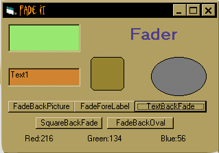



## Fader \.Bas

### Description

This.Bas Comes with Example form. This will Fade any Object Not from left to right but in an animated Pulse. Fades either Backcolor or Forecolor. I've not seen anything like it. PLEASE VOTE if you Download it!! It only takes 5 seconds!
 
### More Info
 

             |
---                |---
**Submitted On**   |2001-12-02 17:46:50
**By**             |[Optima Multimedia](https://github.com/Planet-Source-Code/PSCIndex/blob/master/ByAuthor/optima-multimedia.md)
**Level**          |Beginner
**User Rating**    |4.0 (8 globes from 2 users)
**Compatibility**  |VB 5\.0, VB 6\.0
**Category**       |[Graphics](https://github.com/Planet-Source-Code/PSCIndex/blob/master/ByCategory/graphics__1-46.md)
**World**          |[Visual Basic](https://github.com/Planet-Source-Code/PSCIndex/blob/master/ByWorld/visual-basic.md)
**Archive File**   |[Fader\_\_Bas390321222001\.zip](https://github.com/Planet-Source-Code/optima-multimedia-fader-bas__1-29414/archive/master.zip)

